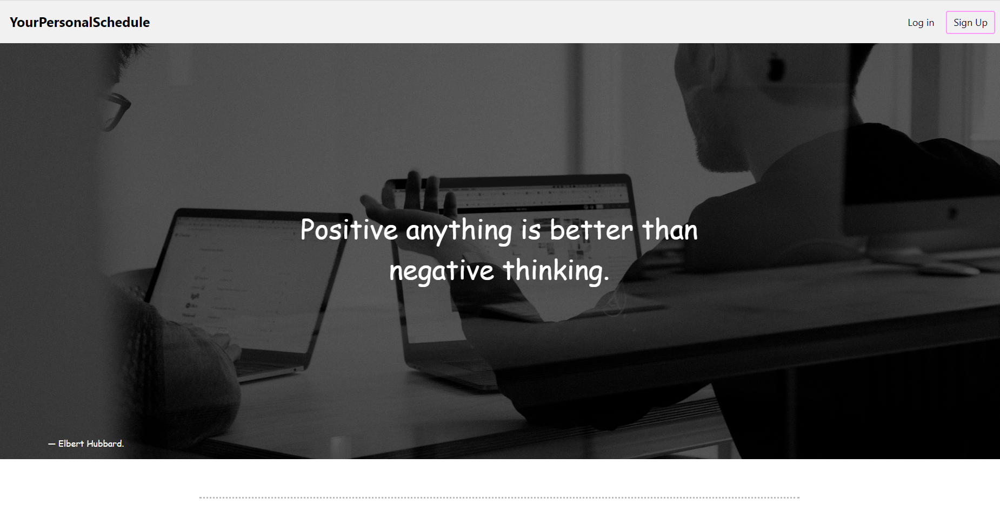
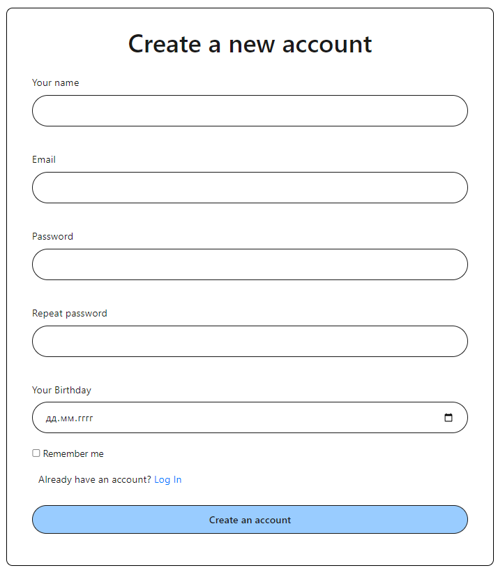
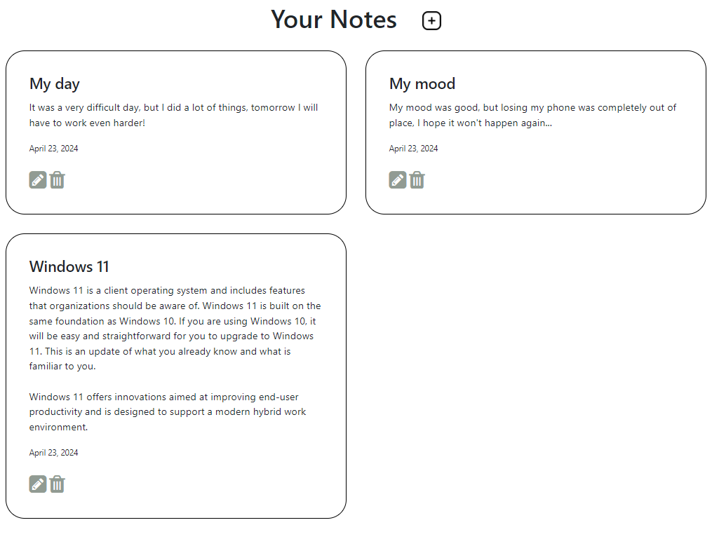
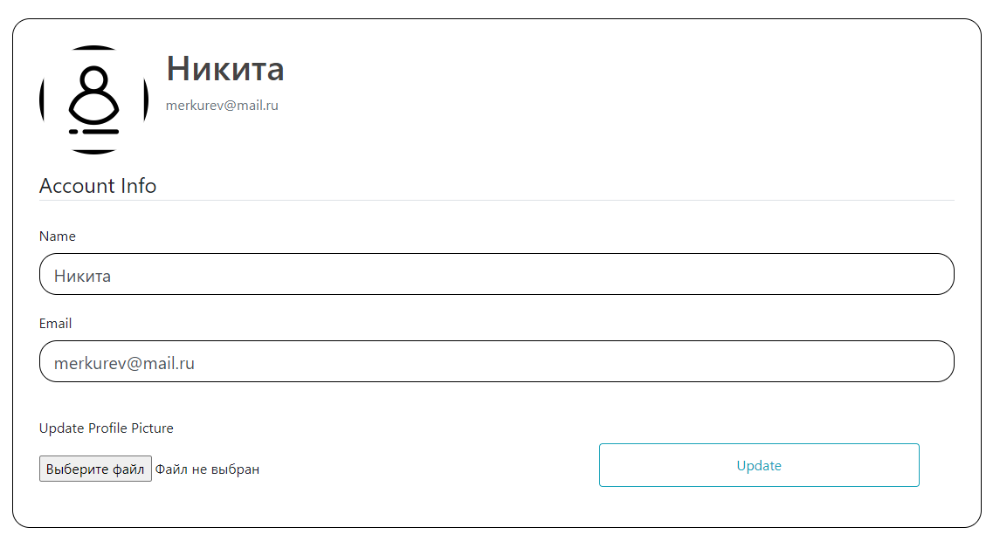

# Your Personal Schedule

  <h1>  
The meaning of the site
  <h1>
 
<h3>
  The meaning of the site:
</h3>
    
_This site contains the most important things in our lives - time. Calendar, notes, to-do lists: We have it all._ 

---
 

---
  <h2>
     Screenshots
  </h2>
  <h2>
     Main Menu
  </h2>
  

  <h2>
     Registration
  </h2>

  <h2>
     Log in
  </h2>

  <h2>
     Calendar
  </h2>

  <h2>
     Notes
  </h2>

  <h2>
     To-do list
  </h2>

  <h2>
     Settings
  </h2>

